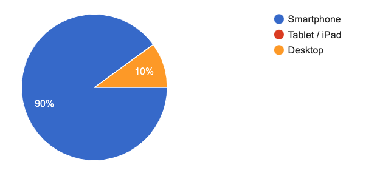
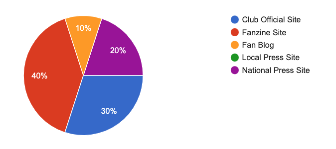
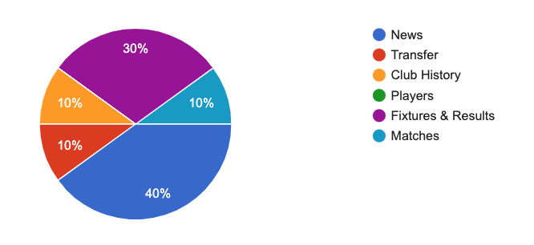
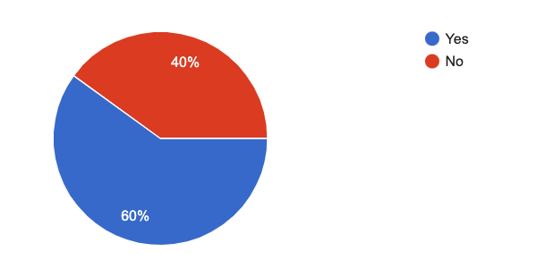

<h1 align="center">Up The Toffees Fanzine Site</h1> 

## **Overview**

Welcome to Up The Toffees, a new fan site for the desirning Evertonian
This site is being built out of the love, dedication and passion that I have for Everton Football Club.
Even though I live 240 miles away from Goodison Park I follow them week in and week out with my season ticket.
With this site I look to offer an insight into the history of the club and how things are looking in the modern day.
I would also be looking to grow a following on the site with member access, this free membership in the future will offer a forum for other fans to discuss all topics Everton and the opportunity to publish blogs and host podcasts.

Live project link to go here.

## **User Experience (UX)**  ##

### **User Stories**

To capture user wants, needs and expectations I created a [Google Forms](https://forms.gle/ERQJZabSsKPZmaJj7) survey, this insight has helped mould the strategy of this website.

-  ### **When looking for content about a football club which platform would you use first?**

**This shows that smartphone is what a majority of users to the site would use, therefore I will use Bootstrap to optimise my mobile first approach.**

-  ### **Which type of websites would you visit for information about your club?**

**Already users are visiting Fanzine Sites, so there is definately a place for this site.**
     
-  ### **Tell me, how you feel about how the layout of the website you chose. What changes would you like to see regarding the layout from this website?**
     1. I find the website *cluttered with content.* I would like to see a layout that is *easier on the eye* and *simple to navigate*.
     2. The website page is *very busy so I’d like it simplified*.
     3. Fairly easy to use, takes some time getting use to.
     4. The club site is *not* the easiest to navigate.
     5. I would like the fixtures and the table to be *easier to access.*
     6. The site I use *looks a bit basic.*

**A few things to consider here, my main focus will be to design a simplified website that also looks great and less cluttered.**

-  ### **Which topic is most important to you when researching your football club?**

**The insight suggests at club news along with fixtures and results are key focus' for the content of this website.**

-  ### **If you were to visit a fanzine site, would you sign up as a member for exclusive offers and content?**

**Football fans will look to join as a member of the site so I will include a sign up page for the site.**

